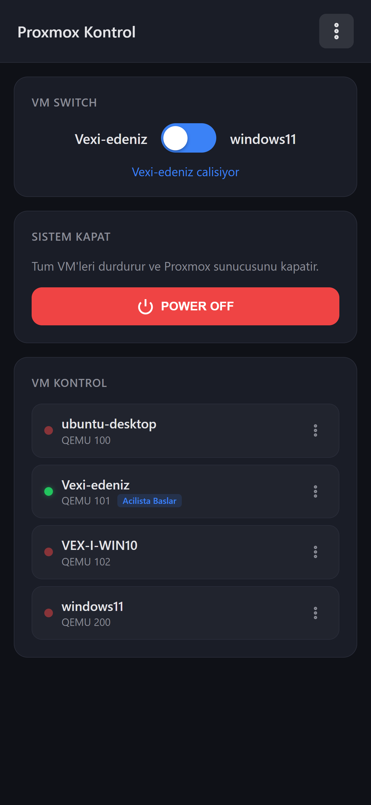

# Proxmox Control Panel

A lightweight, mobile-friendly web panel for managing Proxmox VE virtual machines — designed for single-PC users who run multiple VMs with GPU passthrough and need to switch between them without a second computer or the Proxmox web UI.

## Screenshot



## Why This Exists

If you use Proxmox on your only PC with PCI passthrough (GPU, USB controllers, NVMe drives), you can't access the Proxmox web UI while a VM has your GPU. You need a way to manage VMs from your phone.

This panel runs directly on the Proxmox host and gives you a simple, touch-friendly interface to:

- **Switch between VMs** with one tap (shuts down one, starts the other)
- **Start/Stop/Restart** any VM with force operation support
- **Detect PCI conflicts** before starting a VM — warns you if a passthrough device is already in use by another running VM and offers to shut it down first
- **Power off** the entire Proxmox host (with double confirmation)

All error scenarios are handled gracefully: stuck tasks are killed before operations, graceful shutdown falls back to force stop after 30 seconds, and PCI conflicts are detected and resolved automatically.

## Features

- **Multiple VM Switches** — Create as many switch toggles as you need, each switching between two VMs. Toggle visibility per switch from settings
- **PCI Conflict Detection** — Compares `hostpci` configurations across VMs before starting (works on both direct start and switch). If a device is in use, shows which VM is using it and offers to shut it down
- **VM Configuration** — View and edit VM settings (Start on Boot) directly from the panel. VMs with "Start on Boot" enabled show a badge in the list
- **Clean Action Menu** — Each VM has a compact dropdown menu (three-dot button) with Start/Stop/Restart and Settings actions
- **Bulk Operations** — Shutdown All VMs (graceful) or Force Stop All VMs from the header menu
- **Dashboard Customization** — Show/hide VM switches and the Power Off button from settings
- **Operation Logs** — Last 100 operations stored with timestamps for debugging
- **Cookie Auth** — Login once, stay logged in for a year (until logout)
- **Multi-language** — Turkish (`tr`) and English (`en`), configured via environment variable
- **Mobile-first UI** — Dark theme, touch-optimized, auto-refreshes every 5 seconds
- **Auto-start** — Runs as a systemd service, starts on boot

## Installation

### Prerequisites

- Proxmox VE host (tested on 8.x / 9.x)
- Node.js (v18+)

### Setup

```bash
# Clone or copy the project to your Proxmox host
cd /root/proxmox_kontrol

# Install dependencies
npm install

# Create .env file
cat > .env << 'EOF'
PANEL_USER=admin
PANEL_PASS=your_password
SESSION_SECRET=any-random-string-here
PANEL_LANG=en
EOF
```

### Environment Variables (`.env`)

| Variable | Description | Default |
|----------|-------------|---------|
| `PANEL_USER` | Login username | *(required)* |
| `PANEL_PASS` | Login password | *(required)* |
| `SESSION_SECRET` | Secret key for auth token generation | `default-secret` |
| `PANEL_LANG` | UI language: `en` or `tr` | `en` |

### Run Manually

```bash
node server.js
# → Proxmox Kontrol Panel: http://localhost:3000
```

### Run as a Service (Recommended)

Create `/etc/systemd/system/proxmox-kontrol.service`:

```ini
[Unit]
Description=Proxmox Kontrol Panel
After=network.target pveproxy.service

[Service]
Type=simple
WorkingDirectory=/root/proxmox_kontrol
ExecStart=/usr/bin/node server.js
Restart=always
RestartSec=5
Environment=NODE_ENV=production

[Install]
WantedBy=multi-user.target
```

Then enable and start:

```bash
systemctl daemon-reload
systemctl enable proxmox-kontrol
systemctl start proxmox-kontrol
```

The panel will now auto-start on every boot and restart on crashes.

### Access

Open `http://<your-proxmox-ip>:3000` on your phone or any browser on the same network.

## How It Works

- Runs on the Proxmox host itself — communicates with the local Proxmox API (`127.0.0.1:8006`)
- No SSH, no external dependencies — just the Proxmox REST API
- Auth cookie persists for 1 year — login once on your phone and forget about it
- Auto-detects the Proxmox node name on startup

### PCI Conflict Detection

When you tap "Start" on a VM (or use a VM Switch), the panel:

1. Reads the target VM's config for `hostpci` entries
2. Reads configs of all currently running VMs
3. Compares PCI addresses (base address matching, e.g., `01:00` matches `01:00.0`)
4. If conflicts found → shows a modal listing which VM uses which device
5. "Shutdown & Start" gracefully shuts down conflicting VMs (with 30s force-stop fallback), then starts your target VM

### VM Switch

Switch toggles let you switch between two pre-configured VMs with one tap:

1. Sends graceful shutdown to the running VM
2. Waits up to 30 seconds for it to stop
3. If still running, force stops it
4. Starts the other VM

You can configure multiple switches and control their visibility from Settings.

### Settings

Accessible from the three-dot menu in the header:

- **Dashboard section** — Toggle Power Off button visibility
- **VM Switches section** — Add/remove switches, set VM IDs, toggle visibility per switch

### VM Actions

Each VM in the list shows a status indicator (colored dot) and a three-dot action menu:

- **Start** (when stopped) — with PCI conflict detection
- **Stop** (when running) — force stop
- **Restart** (when running) — force stop + start
- **Settings** — edit VM configuration (Start on Boot toggle)

VMs with "Start on Boot" enabled display a badge next to their ID.

## Project Structure

```
proxmox_kontrol/
├── server.js          # Express API server + auth + Proxmox API client
├── package.json       # Dependencies
├── .env               # Configuration (credentials, language)
├── settings.json      # Runtime settings (switches, dashboard options)
├── logs.json          # Operation log (last 100 entries)
└── public/
    ├── index.html     # Main page structure
    ├── app.js         # Frontend logic + i18n translations
    └── style.css      # Dark theme, mobile-first styles
```

## API Endpoints

All endpoints (except `/login` and `/api/lang`) require authentication.

| Method | Endpoint | Description |
|--------|----------|-------------|
| GET | `/api/lang` | Get configured language |
| GET | `/api/settings` | Get panel settings |
| POST | `/api/settings` | Update panel settings |
| GET | `/api/vms` | List all VMs with onboot info |
| GET | `/api/vm/:vmid/status` | Get VM status |
| GET | `/api/vm/:vmid/config` | Get VM configuration |
| POST | `/api/vm/:vmid/onboot` | Set VM start on boot |
| GET | `/api/vm/:vmid/pci-conflicts` | Check PCI device conflicts |
| POST | `/api/vm/:vmid/start` | Start a VM |
| POST | `/api/vm/:vmid/shutdown` | Graceful shutdown |
| POST | `/api/vm/:vmid/stop` | Force stop |
| POST | `/api/vm/:vmid/reset` | Force reset |
| POST | `/api/vm/:vmid/kill-tasks` | Kill stuck tasks |
| POST | `/api/switch` | Switch between configured VMs |
| POST | `/api/shutdown-all` | Graceful shutdown all VMs |
| POST | `/api/force-stop-all` | Force stop all VMs |
| POST | `/api/poweroff` | Stop all VMs + shutdown host |
| GET | `/api/logs` | Get operation logs |
| GET | `/api/tasks` | Get running Proxmox tasks |

## License

MIT
